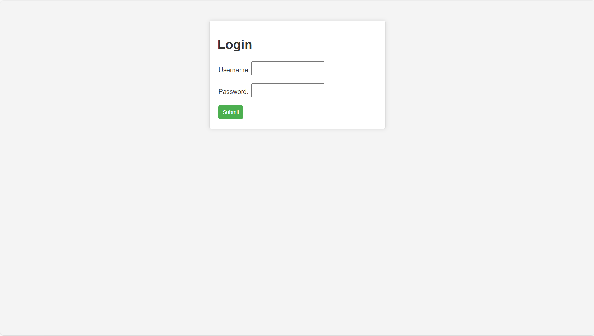
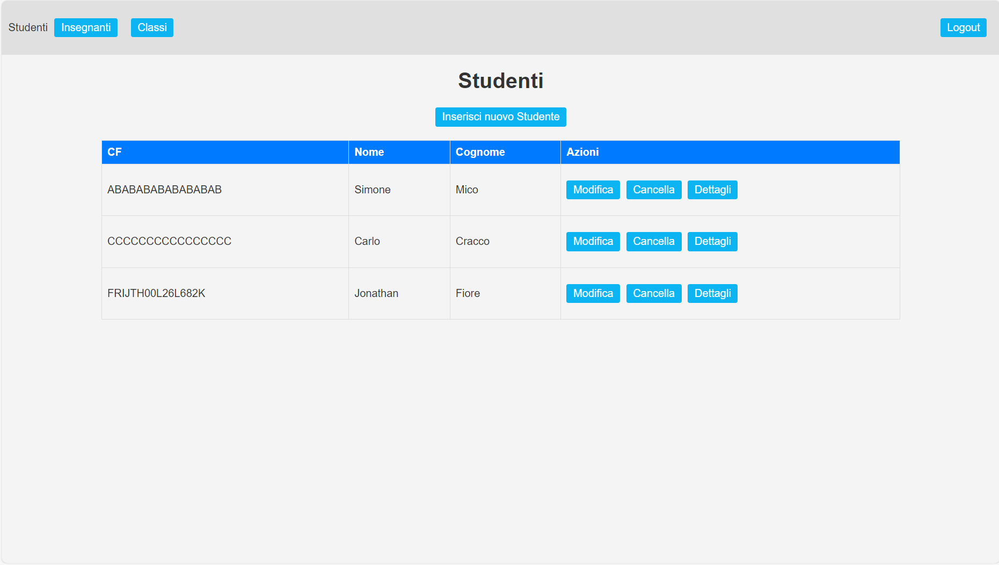
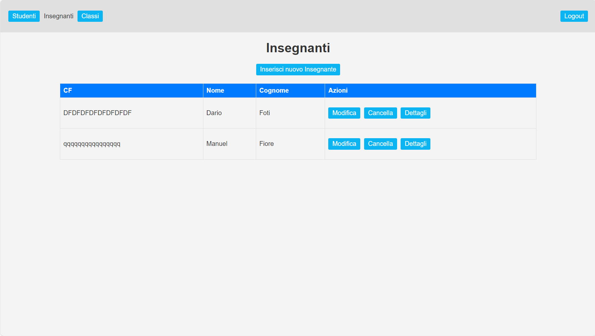
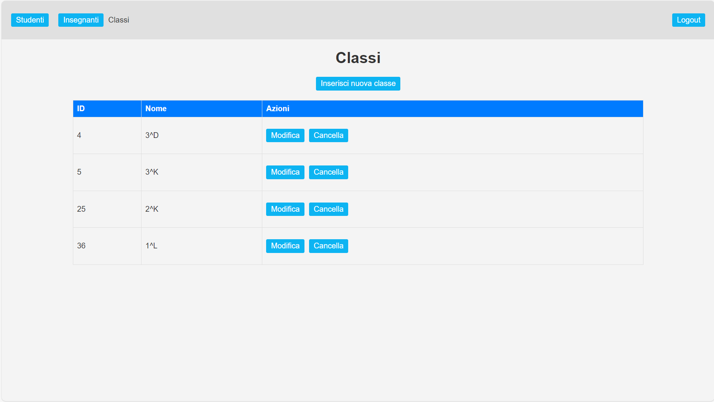
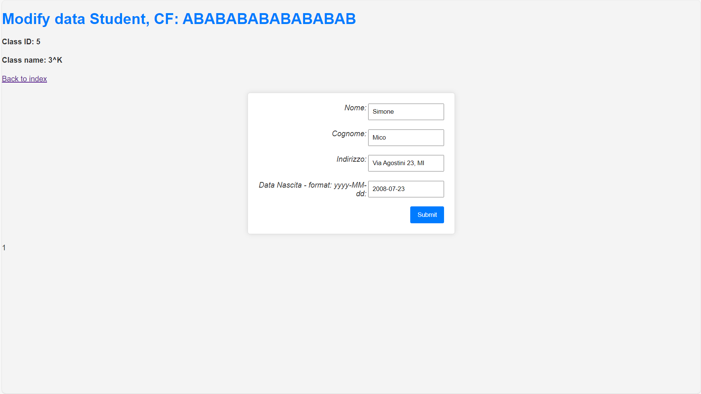
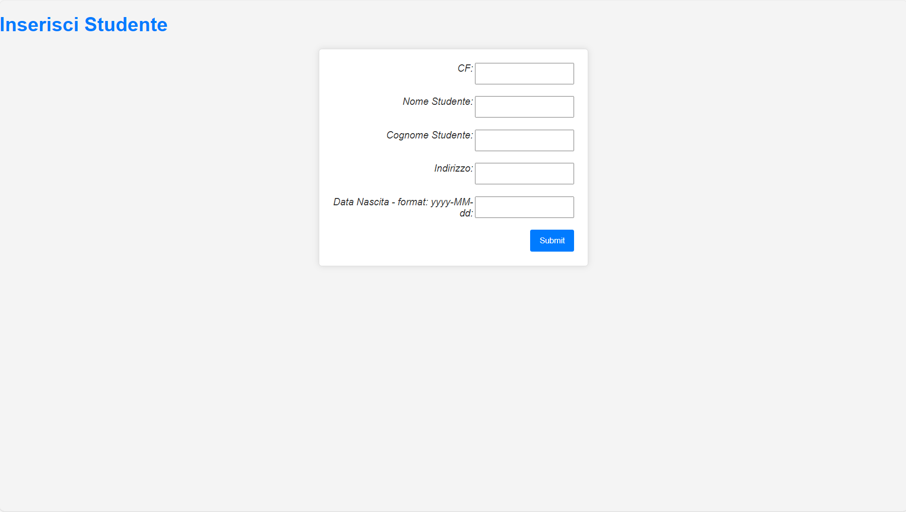
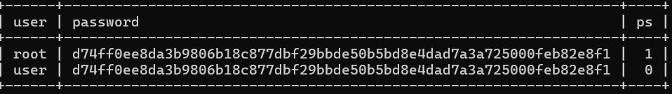

# Struts2 Framework - School Manager

### Programming Languages and technologies:
> - 
Java
 
> - 
SQL

> - 
HTML

> - 
CSS

> - 
JSP

 

---
 

### Tools and Framework:
> - 
IDE: Eclipse

> - 
Struts2 Framework

> - 
MariaDB

> - 
MySQLi

 

---
 

### Description:

The project involves the management of classes, teachers, and students within a school.

The application allows performing management operations such as inserting a student into a class or assigning teachers to classes.

The system handles 2 types of users: Power and Standard

**Power:**

Can perform insertions, deletions, and modifications of students, teachers, and classes, and all the aforementioned management operations

**Standard**

Can only view data of students, teachers, and classes

 

---
 

### Pictures:

#### Login Page:

#### Student Home Page:

#### Teacher Home Page:

#### Class Home Page:

#### Data edit Page:

_For simplicity's sake, we only show the students' edit page_

#### Insert Page:

_For simplicity's sake, we only show the students' insert page_

#### DB data:

_Password are encrypted with SHA-256_
 

---
 

***Theese pictures are only about the Power User vision***

